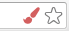
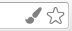

# Chrome Stylus Pressure

Extension for chrome providing stylus pressure data to the browser

## Supported systems

* **Windows XP/Vista/7+** - wintab compatible tablets
* **Windows 8+** - all tablets using pointer events

## Installation

1. Install extension from [chrome web store](https://chrome.google.com/webstore/detail/stylus-pressure/ecelnbeiglepohnlccefodfpmedepoll)
2. Go to my [drawing application](https://aggie.io/stylus-pressure)
3. Click on the red brush icon in your address bar<br>
4. Install additional native application provided in the popup window
5. Stylus pressure should work now in your browser

## Usage

To use the plugin on your site you need to add url of the site to `extension/manifest.json` file. There are 2 options:
* **fork extension** with changed manifest and publish it on chrome web store
* **post an issue** and I'll add your site to the list

For development you can add extension with updated manifest to your browser
in dev mode by dragging the `extension` directory onto extension list in chrome.
You'll need to redirect one of the existing urls from `manifest.json` to your localhost
or other test url for the extension to work.

If the extension is loading correctly, it should show up in your address bar:



If the brush is red, the extension is not working properly, click on the icon to open 
popup window with explanation of the issue.

If extension stops working during usage try clicking the icon and using **restart**
button to fix the issue.

### Usage in javascript

```javascript
var tablet = window.Tablet;
var pen = tablet.pen;
var drawArea = document.getElementById('draw-area');

drawArea.addEventListener('mousemove', function (e) {
	console.log('pressure', pen.pressure);
});
```

Pressure packets are delayed relative to mouse events, due to asynchronous nature of
the plugin. You may need to use `gotPressure` callback hook to wait for pressure packet
after each mouse event if you need more precise measurements.

### Object definitions

```typescript
interface Tablet {
	// callback function to call after receiving each pressure packet
	gotPressure: (pressure: number) => void;
	// returns last status message
	error(): TabletStatus;
	// returns pen object
	pen(): Pen;
}

interface TabletStatus {
	// error code
	//     'install' - needs installation of native plugin
	//     'unknown' - unknown error
	code: string;
	message: string;     // full error message
	installLink: string; // link to native plugin setup
}

interface Pen {
	pressure: number;    // pressure value 0-1
	extension: boolean;  // true
	pointerType: number; // 0 - out of proximity, 1 - pen, 2 - mouse, 3 eraser
}
```

## Building

### Requirements

#### Windows

* [Visual Studio](https://www.visualstudio.com/en-us/products/visual-studio-community-vs.aspx)
* [WIX Toolset](http://wixtoolset.org/) for generating setup

#### Linux

* XInput libraries: `lix11-dev` and `xorg-dev` `sudo apt-get install lix11-dev xorg-dev`
* make
* g++
* fakeroot: needed when generating .deb package `sudo apt-get install fakeroot`

#### OSX

*TODO*

## Development

*TODO: how to setup running debug binaries*
